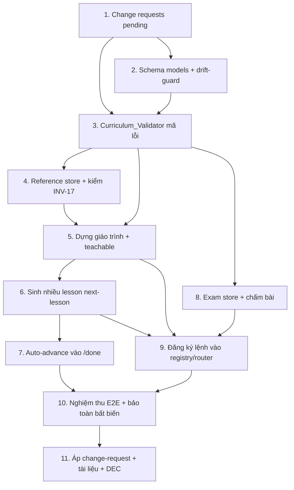

# Implementation Plan

## Overview

Kế hoạch triển khai tính năng **Học theo giáo trình**. Kỷ luật xuyên suốt: **RED-first** (test đỏ trước khi code kiểm); sau mỗi task chạy **full suite + `validate --scope full` PASS**; đổi schema/registry/spec đi qua **change-request §12** (owner "Duyệt" trước khi áp); ghi **DEC** vào decisions journal. Nguồn sự thật index bài vẫn là `topic_state.lessons[]` (INV-25); `curriculum.points[].lesson_id` chỉ là tham chiếu được validate khớp.

## Task Dependency Graph



```json
{
  "waves": [
    { "wave": 1, "tasks": ["1"], "rationale": "Change requests pending — gốc của mọi thay đổi schema/lệnh/spec (§12)." },
    { "wave": 2, "tasks": ["2"], "rationale": "Schema models + drift-guard (nội bộ, không đụng registry)." },
    { "wave": 3, "tasks": ["3"], "rationale": "Curriculum_Validator mã lỗi cấu trúc — cần CR-0007 approved + model (T2)." },
    { "wave": 4, "tasks": ["4"], "rationale": "Reference store + kiểm INV-17 — cần validator (T3)." },
    { "wave": 5, "tasks": ["5"], "rationale": "Dựng giáo trình + teachable — cần validator (T3) và reference (T4)." },
    { "wave": 6, "tasks": ["6", "8"], "rationale": "Sinh nhiều lesson (cần T5) + Exam store (cần T3) — độc lập nhau, chạy song song được." },
    { "wave": 7, "tasks": ["7", "9"], "rationale": "Auto-advance (cần T6) + đăng ký lệnh registry/router (cần T5/T6/T8)." },
    { "wave": 8, "tasks": ["10"], "rationale": "Nghiệm thu E2E + bảo toàn bất biến — cần T7 và T9." },
    { "wave": 9, "tasks": ["11"], "rationale": "Áp change-request + tài liệu + DEC — sau khi toàn bộ code XANH." }
  ]
}
```

## Tasks

- [x] 1. Change requests (pending) cho toàn tính năng
  - Soạn `_system/change_requests/pending/cr-0007-curriculum-exam-schema.md` (schema mới `curriculum` + `exam_results`).
  - Soạn `_system/change_requests/pending/cr-0008-curriculum-commands.md` (5 lệnh mới: collect / curriculum / curriculum --check / next-lesson / grade).
  - Soạn `_system/change_requests/pending/cr-0009-spec-multilesson-reference-exam.md` (mở rộng spec §3/§11A/§14 cho multi-lesson + reference/ + exam/).
  - DỪNG chờ owner "Duyệt" từng CR trước khi áp phần tương ứng bên dưới.
  - _Requirements: 4.3, 11.1_

- [x] 2. Nền schema: model + schemas/ + drift-guard cho `curriculum` và `exam_results`
- [x] 2.1 RED-first test schema drift-guard
  - Thêm `schemas/curriculum.schema.md` + `schemas/exam_results.schema.md` (khối `schema_fields` máy-đọc).
  - Mở rộng `phase10/test_schemas_consistency.py`: `schema_fields` khớp `models.py` — chạy thấy ĐỎ (model chưa có).
  - _Requirements: 3.1, 3.2, 3.3, 3.6, 11.5_
- [x] 2.2 Thêm pydantic model `Curriculum`, `CurriculumPoint`, `ExamResults`, `ExamResult` vào `validator/models.py`
  - Kiểu chặt: `id` str, `order` int, `objective` str, `status` Literal, `lesson_id` Optional, `source_refs` list[str]; `current_point` str; `teachable` bool.
  - Chạy lại 2.1 → XANH. Full suite PASS.
  - _Requirements: 3.2, 3.3, 3.6_

- [x] 3. Curriculum_Validator — mã lỗi cấu trúc (RED-first từng mã), sau khi CR-0007 approved
- [x] 3.1 `E-CURR-SCHEMA` + `E-CURR-DUP-ID` + `E-CURR-ORDER`
  - Viết test đỏ: curriculum sai schema / trùng id / order hở-trùng → mã tương ứng.
  - Hiện thực `_check_curriculum` trong `validate.py` (đọc curriculum.md nếu có; bọc EIoEncoding→E-IO-ENCODING).
  - _Requirements: 3.1, 3.7, 10.1, 10.2_
- [x] 3.2 `E-CURR-EMPTY-OBJECTIVE` + `E-CURR-BADSTATUS`
  - Test đỏ (objective rỗng / status ngoài tập) → mã tương ứng; rồi hiện thực.
  - _Requirements: 3.3, 3.6, 5.3, 10.2_
- [x] 3.3 `E-CURR-POINTER` (con trỏ dangling, INV-03) + `E-CURR-LESSON-LINK` (INV-25)
  - Test đỏ: `current_point` trỏ point không tồn tại; `lesson_id` trỏ lesson không có trên đĩa.
  - Hiện thực bám diễn giải INV-03/INV-25 hiện có (giống DEC-031/037/039).
  - _Requirements: 6.4, 6.5, 7.5, 10.3, 10.2_
- [x] 3.4 `E-CURR-REF-BROKEN` (source_refs trỏ file reference không tồn tại)
  - Test đỏ; hiện thực kiểm mỗi `source_refs[i]` là đường dẫn tương đối tồn tại trong `reference/`.
  - Cập nhật `rules/validation_rules.md` khối `error_codes` (drift-guard) cho các mã mới.
  - _Requirements: 1.4, 5.6, 10.1_

- [x] 4. Reference store + kiểm INV-17 cho reference/
- [x] 4.1 RED-first: test `reference/` chỉ chứa `.md` (gộp INV-17 — DEC-062)
  - Test đỏ: đặt file code trong `reference/` → cảnh báo/không hợp lệ; `.md` thì OK.
  - Hiện thực kiểm nhẹ (reference/ chỉ `.md`), giữ INV-17 vault PASS.
  - _Requirements: 1.1, 2.4, 11.4_
- [x] 4.2 Năng lực "thu thập dữ liệu" (backend `collect`) — sau CR-0008 approved
  - `cmd_collect`: ghi lát cắt markdown → `reference/<topic>/<slug>.md` + entry `sources.md` (status raw), transaction-LIGHT.
  - Offline/thiếu nguồn → lỗi sạch, không tạo file rác (R1.5/R1.6).
  - Test: tạo reference + sources entry; ca thiếu nguồn → E-* sạch.
  - _Requirements: 1.1, 1.3, 4.2, 4.4, 4.5, 4.7_

- [x] 5. Dựng giáo trình (backend `curriculum`) + cổng teachable — sau CR-0008 approved
- [x] 5.1 `cmd_curriculum` tạo `curriculum.md` từ `reference/` (transaction-FULL)
  - Sinh points (id cp-NNN, order 1..N, objective, status not_started, source_refs truy vết reference).
  - Chạy Curriculum_Validator; chỉ set `teachable=true` khi PASS (R5.2). Thiếu nguồn → không tạo (R1.5).
  - Test: reference có → curriculum hợp lệ + teachable; ca lỗi → teachable=false.
  - _Requirements: 1.2, 1.4, 3.1, 3.4, 5.1, 5.2, 5.5_
- [x] 5.2 `cmd_curriculum --check` (read-only) in báo cáo PASS/FAIL (gộp vào /validate — DEC-063)
  - Không transaction; tái dùng `_check_curriculum`.
  - _Requirements: 5.1, 5.2_
- [x] 5.3 Bổ sung điểm giữa chừng (R8) — chèn point, giữ tiến độ, re-validate (CR-0010: /curriculum --insert-at, DEC-069)
  - Test: chèn point tại vị trí, giữ id/tiến độ cũ, id mới duy nhất; validate lại; vị trí/id xấu → từ chối.
  - _Requirements: 8.1, 8.2, 8.3, 8.4, 8.5, 8.6, 8.7_

- [x] 6. Sinh nhiều lesson bám giáo trình (backend `next-lesson`) — sau CR-0008 approved
  - `cmd_next_lesson` tạo `lesson-NNN` cho `current_point`: chỉ khi `teachable=true` (R6.8); objective bám point; set `points[].lesson_id`.
  - Cập nhật `topic_state.lessons[]` khớp đĩa (INV-25) trong transaction-FULL; rollback nếu fail.
  - Test đỏ→xanh: sinh lesson-002 hợp lệ + FULL PASS; ca point không tồn tại/teachable=false → từ chối.
  - _Requirements: 6.1, 6.2, 6.3, 6.4, 6.5, 6.6, 6.7, 6.8_

- [x] 7. Auto-advance móc vào `cmd_done` (R7)
  - Trong cùng transaction của `/done` khi lesson đạt learned_gate: set point.status=done; dời `current_point` sang point chưa done theo order nhỏ nhất; hết → curriculum hoàn tất.
  - Chưa qua gate → không đụng con trỏ; validate fail → rollback.
  - Test tất định: qua gate → tiến; chưa gate → giữ nguyên; hết point → hoàn tất.
  - _Requirements: 7.1, 7.2, 7.3, 7.4, 7.5, 7.6, 10.4_

- [x] 8. Exam store + chấm bài (backend `grade`) — sau CR-0007/0008 approved
- [x] 8.1 RED-first `E-EXAM-REF-BROKEN` + kiểm ref-integrity bản ghi chấm
  - Test đỏ: `exam_results` entry trỏ submission/target không tồn tại → mã lỗi.
  - Hiện thực `_check_exam_results` (Class A: ref tồn tại; verdict là Class D không kiểm nội dung).
  - _Requirements: 9.4, 9.6, 10.1_
- [x] 8.2 `cmd_grade` tạo entry `exam_results.md` (transaction-LIGHT), ref tương đối tới `exam/` ngoài vault
  - Submission/target không tồn tại → từ chối (R9.6); transaction fail → rollback (R9.7).
  - Test: grade hợp lệ tạo bản ghi; ca ref gãy → từ chối; xác nhận vault vẫn PASS INV-16/17.
  - _Requirements: 9.1, 9.2, 9.3, 9.5, 9.7, 11.4_

- [x] 9. Đăng ký lệnh vào registry + router (sau CR-0008 approved)
  - Thêm 5 lệnh vào `commands.md` (backends) + `CLI_COMMANDS` + parser trong `session.py` + `router_prompt.md`.
  - Drift-guard `test_commands_registry` / `test_router_prompt_consistency` phải XANH (registry↔CLI↔router khớp).
  - _Requirements: 4.1, 4.2, 4.3, 4.6, 11.1_

- [x] 10. Nghiệm thu E2E tất định + bảo toàn bất biến
- [x] 10.1 E2E test chuỗi thật trên vault tmp
  - `collect → curriculum(teachable) → check(PASS) → next-lesson → done(gate) → auto-advance → next-lesson-002`, FULL PASS mỗi bước ghi.
  - _Requirements: 6.1, 6.2, 7.1, 7.2, 10.4, 10.5_
- [x] 10.2 Test bảo toàn bất biến nền
  - Khẳng định vault ship (rỗng) + vault có curriculum đều PASS INV-16/17/18/25; `test_shipped_vault_clean` vẫn XANH.
  - _Requirements: 10.6, 11.2, 11.3, 11.4_

- [x] 11. Áp change-request + tài liệu + DEC (sau khi code XANH)
  - Move CR-0007/0008/0009 pending→approved + `changelog.md`; cập nhật `HUONG_DAN.md` (lệnh mới) + drift-guard test_huong_dan XANH.
  - Ghi DEC-055.. vào `decisions/` + cập nhật `index.yaml` (note_latest, NOTE-003 baseline test mới); chạy journal consistency check (tạo→chạy→xóa).
  - Full suite + `validate --scope full` PASS lần cuối.
  - _Requirements: 4.3, 11.1, 11.5_

## Notes

- Thứ tự áp change-request: CR-0007 (schema) → CR-0008 (lệnh) → CR-0009 (spec). Task 2 làm được ngay (schema nội bộ); Task 3+ cần CR-0007 approved; Task 4.2/5/6/8.2/9 cần CR-0008 approved.
- Mỗi task chỉ merge khi full suite + validator PASS. Không để code mồ côi (mỗi bước tích hợp vào đường chạy thật).
- `exam/` nằm NGOÀI `learning_vault/` (bài nộp có thể là code) — chỉ bản ghi chấm (không code) ở trong vault.
- Phần "đủ sâu/rộng/chính xác nội dung giáo trình" và chất lượng bài exam là Class D — KHÔNG có mã lỗi, do người/AI đánh giá.
