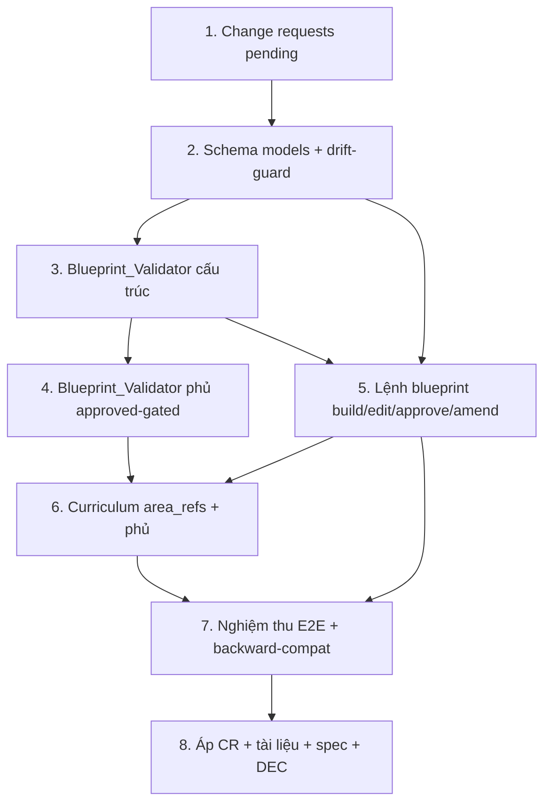

# Implementation Plan

## Overview

Kế hoạch triển khai **Khung giáo trình bắt buộc** (`Topic_Blueprint`). Kỷ luật xuyên suốt: **RED-first**
(test đỏ trước khi code kiểm); sau mỗi task chạy **full suite + `validate --scope full` PASS**; đổi
schema/registry/spec đi qua **change-request §12** (owner "Duyệt" trước khi áp); ghi **DEC** vào decisions
journal. Nguồn sự thật index bài vẫn là `topic_state.lessons[]` (INV-25). Ép phủ CHỈ khi blueprint
`approved` (QĐ-2). Coverage_Map đặt ở `CurriculumPoint.area_refs` (QĐ-1). Phủ là bất biến LIÊN TỤC trong
full-validate (QĐ-3).

## Task Dependency Graph



```json
{
  "waves": [
    { "wave": 1, "tasks": ["1"], "rationale": "Change requests pending — gốc mọi thay đổi schema/lệnh/spec (§12)." },
    { "wave": 2, "tasks": ["2"], "rationale": "Schema models Blueprint/MandatoryArea + area_refs + drift-guard (không đụng registry)." },
    { "wave": 3, "tasks": ["3"], "rationale": "Blueprint_Validator mã lỗi cấu trúc — cần CR-0011 approved + model (T2)." },
    { "wave": 4, "tasks": ["4"], "rationale": "Kiểm phủ approved-gated — cần validator cấu trúc (T3)." },
    { "wave": 5, "tasks": ["5"], "rationale": "Lệnh blueprint (build/edit/approve/amend) — cần model (T2) + validator (T3)." },
    { "wave": 6, "tasks": ["6"], "rationale": "Curriculum mang area_refs + wiring phủ — cần T4 (kiểm phủ) + T5 (lệnh)." },
    { "wave": 7, "tasks": ["7"], "rationale": "E2E + backward-compat — cần T5/T6." },
    { "wave": 8, "tasks": ["8"], "rationale": "Áp CR + tài liệu + spec v2.8 + DEC — sau khi toàn bộ code XANH." }
  ]
}
```

## Tasks

- [ ] 1. Change requests (pending) cho toàn tính năng
  - Soạn `_system/change_requests/pending/cr-0011-blueprint-schema.md` (schema `blueprint` mới).
  - Soạn `_system/change_requests/pending/cr-0012-curriculum-area-refs.md` (thêm `CurriculumPoint.area_refs`).
  - Soạn `_system/change_requests/pending/cr-0013-blueprint-commands.md` (lệnh blueprint + curriculum nhận area_refs).
  - Soạn `_system/change_requests/pending/cr-0014-spec-blueprint.md` (mở rộng spec §3.5, áp sau khi code xanh).
  - _Requirements: 7.1, 7.6_

- [ ] 2. Nền schema: model + schemas/ + drift-guard cho `blueprint` và `area_refs`
- [ ] 2.1 RED-first test schema drift-guard
  - Thêm `schemas/blueprint.schema.md` (khối `schema_fields` máy-đọc) + cập nhật `curriculum.schema.md` (thêm `area_refs`).
  - Mở rộng `phase10/test_schemas_consistency.py`: `MODEL_BY_SCHEMA += {blueprint}`; `area_refs` vào optional curriculum — chạy thấy ĐỎ (model chưa có).
  - _Requirements: 1.1, 1.2, 1.3, 6.5, 7.5_
- [ ] 2.2 Thêm pydantic model `Blueprint`, `MandatoryArea` + field `CurriculumPoint.area_refs`
  - `MandatoryArea`: `id`(^ma-\S+$), `order`(int≥1), `title`(str), `mandatory`(bool), `source_refs`(list[str]).
  - `Blueprint`: `schema`, `schema_version`, `topic_id`, `status`(Literal draft|approved), `areas`(list), `created`, `updated`(≥created).
  - `CurriculumPoint.area_refs: list[str] = []` (tương thích ngược).
  - Đăng ký `blueprint` vào `_SCHEMA_MODELS` + `blueprint.md` vào `_SYSTEM_DATA_NAMES` (INV-18).
  - Chạy lại 2.1 → XANH. Full suite PASS (curriculum cũ không hồi quy).
  - _Requirements: 1.2, 1.3, 1.5, 6.5, 7.3_

- [ ] 3. Blueprint_Validator — mã lỗi cấu trúc (RED-first từng mã), sau khi CR-0011 approved
- [ ] 3.1 `E-BP-DUP-ID` + `E-BP-ORDER` + `E-BP-EMPTY-TITLE`
  - Test đỏ: area trùng id / order trùng-hở / title rỗng → mã tương ứng.
  - Hiện thực `_check_blueprint` trong `validate.py` (đọc blueprint.md nếu có; bọc EIoEncoding→E-IO-ENCODING); wire cuối `_validate_topic`.
  - _Requirements: 1.1, 1.3, 1.6, 6.1, 6.2, 6.3_
- [ ] 3.2 `E-BP-REF-BROKEN` (source_refs blueprint trỏ file reference/ tồn tại)
  - Test đỏ; hiện thực resolve tương đối `topic_dir` (song song E-CURR-REF-BROKEN, abspath do E-PORT-ABSPATH).
  - _Requirements: 2.2, 6.1_
- [ ] 3.3 `E-BP-AREA-REF-BROKEN` (curriculum point.area_refs trỏ area tồn tại)
  - Test đỏ: `area_refs` trỏ area không có trong blueprint → mã. Hiện thực đọc curriculum + blueprint cùng topic (INV-03).
  - Cập nhật `rules/validation_rules.md` khối `error_codes` (drift-guard) cho mã 3.1–3.3.
  - _Requirements: 3.5, 3.6, 6.1_

- [ ] 4. Blueprint_Validator — kiểm phủ (approved-gated), RED-first
- [ ] 4.1 `E-BP-AREA-UNCOVERED` (area mandatory chưa phủ khi blueprint approved)
  - Test đỏ: blueprint approved + area mandatory không point nào có id trong area_refs → mã; blueprint draft → KHÔNG kích (P9).
  - Hiện thực `_check_blueprint_coverage` gate `status==approved`.
  - _Requirements: 3.1, 3.2, 3.3, 3.4, 5.4_
- [ ] 4.2 `E-BP-POINT-OUTSIDE` (point không ánh xạ area nào khi blueprint approved)
  - Test đỏ: blueprint approved + point có area_refs rỗng → mã; draft/không blueprint → KHÔNG kích (P9, backward-compat).
  - Cập nhật `validation_rules.md` error_codes (mã 4.1–4.2). Coverage 2 chiều drift-guard.
  - _Requirements: 5.1, 5.2, 5.4_

- [ ] 5. Lệnh blueprint (build/edit/approve/amend) — sau CR-0013 approved
- [ ] 5.1 `cmd_blueprint` build (draft) transaction-FULL
  - Sinh `blueprint.md` (status=draft) từ danh sách area (JSON: title/mandatory/source_refs); backend gán ma-NNN + order 1..N.
  - Đã tồn tại → từ chối (R2.4). Thiếu tham số → SessionError (R2.5, không đoán). Ghi qua transaction-FULL (R2.3).
  - Test: build hợp lệ → PASS; build lần 2 → từ chối; area xấu → validate ABORT không để lại file bộ phận.
  - _Requirements: 1.5, 2.1, 2.3, 2.4, 2.5_
- [ ] 5.2 `cmd_blueprint --edit` (chỉ draft) + `--approve` (draft→approved gate validator PASS)
  - `--edit`: thêm/xóa/sửa/sắp xếp area khi draft (transaction-FULL). Approved → từ chối `--edit` (R4.3).
  - `--approve`: chạy `_check_blueprint`; PASS → status=approved; FAIL → giữ draft + SessionError (R4.6).
  - Test: edit draft OK; edit approved bị chặn; approve khi validator FAIL → giữ draft.
  - _Requirements: 4.1, 4.2, 4.3, 4.6_
- [ ] 5.3 `cmd_blueprint --amend --confirm` (sửa approved có kiểm soát)
  - Sửa area khi approved CHỈ khi có cờ `--confirm` tường minh; transaction-FULL re-validate; rollback nếu FAIL (R4.4).
  - Thiếu `--confirm` trên blueprint approved → từ chối, giữ nguyên (R4.3).
  - Test: amend --confirm OK + để lại vết transaction log (R4.5); amend thiếu confirm → chặn.
  - _Requirements: 4.3, 4.4, 4.5_

- [ ] 6. Curriculum mang `area_refs` + wiring phủ — sau CR-0012/0013 approved
  - Mở rộng `cmd_curriculum` (+ `cmd_curriculum_insert`) nhận `area_refs` cho từng point (JSON), default `[]`.
  - Khẳng định: curriculum có area_refs phủ đủ blueprint approved → teachable=true qua transaction-FULL (validator gate).
  - Thiếu phủ → E-BP-AREA-UNCOVERED → transaction ABORT → không teachable (QĐ-3).
  - Đăng ký đồng bộ CLI_COMMANDS/parser/dispatch/commands.md/router (drift-guard xanh).
  - _Requirements: 3.3, 3.4, 5.3, 7.1_

- [ ] 7. Nghiệm thu E2E tất định + bảo toàn bất biến
- [ ] 7.1 E2E chuỗi thật trên vault tmp
  - `blueprint(draft) → edit → approve → curriculum(area_refs phủ đủ) → validate PASS → next-lesson`, FULL PASS mỗi bước.
  - Ca âm: approve → curriculum THIẾU phủ → validate FAIL E-BP-AREA-UNCOVERED + không teachable + không sinh lesson.
  - _Requirements: 3.2, 3.3, 3.4, 6.3, 6.4_
- [ ] 7.2 Backward-compat + bất biến nền
  - Vault có curriculum KHÔNG blueprint (hoặc blueprint draft) → PASS y như trước (P9). `test_shipped_vault_clean` XANH.
  - Khẳng định vault PASS INV-16/17/18/25 sau feature; blueprint path tuyệt đối → FAIL (INV-16).
  - Overlay test (DEC-073): blueprint+curriculum+area_refs trong transaction-FULL không false-positive.
  - _Requirements: 5.4, 6.4, 7.3, 7.4_

- [ ] 8. Áp change-request + tài liệu + spec + DEC (sau khi code XANH)
  - Move CR-0011/0012/0013/0014 pending→approved + `changelog.md`; cập nhật `HUONG_DAN.md` (lệnh blueprint) + drift-guard XANH.
  - Mở rộng spec `PROMPT_LEARNING_SYSTEM.md` §3.5 (Topic_Blueprint + Blueprint_Validator + 7 mã E-BP-* + vòng đời approve); bump v2.7→v2.8.
  - Ghi DEC vào `decisions/` + cập nhật `index.yaml` (note_latest, NOTE-003 baseline test mới); journal consistency check.
  - _Requirements: 6.5, 7.1, 7.2, 7.3_

## Notes

- **Ba quyết định gốc** (xem `design.md`): QĐ-1 Coverage_Map ở `CurriculumPoint.area_refs`; QĐ-2 ép phủ chỉ khi blueprint `approved`; QĐ-3 phủ là bất biến liên tục trong full-validate.
- **RED-first bắt buộc** mỗi mã E-BP-* (test ĐỎ trước khi hiện thực) — R6.2.
- **Không bump `_system/VERSION`** (schema_version per-file = 1, additive; tiền lệ CR-0007/DEV-006). Spec tài liệu bump v2.7→v2.8.
- **Tương thích ngược là ràng buộc cứng**: `area_refs` default `[]`; topic không blueprint / draft → hành vi curriculum-driven cũ giữ nguyên (P9).
- **Class D không có mã máy**: "đủ tầm chuyên gia / nội dung đúng-sâu" do người/AI đánh giá (R3.7) — validator KHÔNG tự nhận.
- Sau mỗi wave XANH: commit git để mọi thay đổi diff/revert được.
